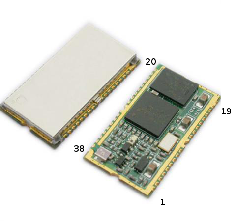
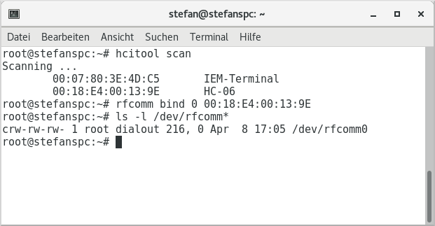

The Bluetooth modules presented here make it possible to connect serial devices
wirelessly to a PC or smartphone. The RFCOMM protocol from the SPP profile is used.

I have had several bad experiences with Chinese Bluetooth modules
and the good BTM-222 is hard to come by.
In addition, Apple's mobile devices do not support the RFCOMM protocol.
Therefore, the [ESP-8266](http://stefanfrings.de/esp8266/index.html) chip
with WLAN may be a better alternative for your project.

## HC-05

The HC-05 from China is intended for 3.3V, but you can also buy it together with
an adapter board for 5V. In my tests, it reached less than 5 meters range with
largely error-free and speedy data transmission.
Even with a short distance the connection to the PC or smartphone fails sporadically.
In the absence of shielding,
this module will probably never receive approval for commercial applications.

As long as the module has no radio connection,
it can be configured (at the Rxd and TxD ports) with AT commands.
After establishing the connection,
it transmits serial data transparently to the connection partner.

The pin assignment is the following:

*  1 = TxD (output)
*  2 = RxD (input)
* 11 = input Low = Reset (not connected = High)
* 12 = supply normal 3.3V 50mA (3..4.2V, short-term 250mA)
* 13 = GND
* 31 = LED 1, constantly flashing
* 32 = LED 2, Low on standby and High on connection.
* 34 = input Low = Normal operation, High = Command mode (unwired = Low) 

Pin 34 can be used to switch to command mode (even during a connection):

* Low: The module can establish connections and execute some AT commands as long
as it is not connected by radio. The baud rate set with AT+UART applies.
* Change from low to high: The module goes into command mode.
The baud rate set with AT+UART applies.
* High while the power is switched on: The module starts in configuration mode,
where it supports all commands. The baud rate in this mode is always 38400.
To exit this mode, the power must be switched off and on again. 

By default, the serial port is 9600 baud and the module is ready to accept
connections from any master (PC or smartphone).
On the serial port, the module can be configured with commands.
These are the most important commands for slave mode:

* **AT+ORGL** Reset all settings to the default values
* **AT+PSWD=1234** Change password (default 1234)
* **AT+NAME=HC-05** Change Name (default HC-05)
* **AT+UART=9600,0,0** Change baud rate from a range of 4800 to 1300000 (default 9600)
* **AT+CMODE=1** Allow connection with any partner (default)
* **AT+CMODE=0** Allow connection only with a specific partner
(Either the last friend or set with AT+BIND)
* **AT+BIND=A854,B2,3FB035** Bind the module to the specified partner
(parameter is the address but with comma instead of colons) 

Other commands are:

* **AT+ROLE?** Poll master / slave mode
* **AT+ADDR?** Query own address
* **AT+PSWD?** Query password
* **AT+NAME?** Interrogate own name
* **AT+CMODE?** Query connection mode
* **AT+RMAAD** Terminate Current Connection and Pairing (if any) 

All commands are terminated with a line break (CRLF or \r\n).
If you send several commands to the module one at a time,
you have to give him enough time after each command to execute the command.
The module can not receive the next command until
the previous command has been executed.

To put the module in master mode and connect it to a slave,
use the following commands:

* **AT+ORGL** Reset all settings to the default values
* **AT+ROLE=1** master mode
* **AT+PSWD=1234* Set the same password as for the slave
* **AT+RMAAD** End current paring (if available)
* **AT+CMODE=0** Allow connection only with a specific partner
* **AT+BIND=A854,B2,3FB035** Bind the module to the specified partner
(parameter is the address but with comma instead of colons)
* **AT+RESET** Restart, the module searches for the slave and tries to connect.
* **AT+LINK=A854,B2,3FB035** Connect to the specified slave 

After these commands, the module automatically connects to the slave in the future.
With **AT+ROLE=0 followed by AT+RESET** one returns to slave mode.

The following commands can be used to search for reachable slaves:

* **AT+CMODE=1** Allow each connection partner
* **AT+INQM=0.5.9** Search up to 5 devices in 9 seconds
* **AT+INIT** If the module responds with ERROR (17): ignore and continue
* **AT+INQ?** Starts the search, for example, gives the address A854:B2:3FB035
* **AT+RNAME?A854,B2,3FB035** Displays the name of an accessible partner 

In some documentation commands are mentioned,
with which one can directly control individual I/O pins.
This feature is obviously optional and not supported by any firmware.

Here is an incomplete [english description](HC-Serial-Bluetooth-Products.pdf)
of HC-05 and HC-06, as well as the instruction set.

## The little brother HC-06

The HC-06 module is sold in two variants: master and slave,
with very few dealers selling the master variant.

* The slave version HC-06-S waits for it to be contacted by a master
(computer or smartphone).
* The master version HC-06-M automatically establishes a connection
to any reachable slave and then remembers it for later connections. 

The operating mode can not be reconfigured. Externally, the modules HC-05, HC-06-M
and HC-06-S look identical. The pin assignment of the HC-06 is a bit different:

*  1 = TxD (output)
*  2 = RxD (input)
* 11 = input Low = Reset (not connected = High)
* 12 = supply normal 3.3V 50mA (3..4.2V, short-term 250mA)
* 13 = GND
* 24 = Status LED, flashing on standby, high on connection.
* 26 = Low input = Normal operation,
High = Deleting the stored connection partner (HC-06-M only, unconnected = Low) 

And also the instruction set is different:

* **AT+BAUD1** Set baud rate to 1200
* **AT+BAUD2** Set baud rate to 2400
* **AT+BAUD3** Set baud rate to 4800
* **AT+BAUD4** Set baud rate to 9600 (= default)
* **AT+BAUD5** Set baud rate to 19200
* **AT+BAUD6** Set baud rate to 38400
* **AT+BAUD7** Set baud rate to 57600
* **AT+BAUD8** Set baud rate to 115200
* **AT+NAMExxxxxx** Change device name to xxxxxx (default linvor)
* **AT+PINxxxx** set password (default 1234) 

With the HC-06, the commands **must not be terminated** with a line break,
otherwise it simply ignores them!

## BTM-222

The BTM-222 module from Rayson has a closed housing and creates a good range
even with a simple piece of wire as the antenna.
5 meters across the living room are no problem.
It also works much more reliably than the HC-05 and HC-06 modules.

As long as the module has no radio connection,
it can be configured (at the Rxd and TxD ports) with AT commands.
After establishing the connection,
it transmits serial data transparently to the connection partner.

There are only a few pins attached:

*  1 = GND
*  2 and 17 = supply 3.3V 100mA (3..3.3V, short-term 300mA)
* 13 = Status LED, blinks on standby and high on connection.
* 26 = RxD (input)
* 27 = TxD (output)
* 37 = antenna: 3cm or 12cm wire 

To connect the BTM-222 to a microcontroller with 5V power supply,
you need a voltage regulator that can deliver 300mA for a short time
(eg LF33CV) and a few small parts:

The most important commands, they only go on the serial port:

* **ATP?** Query password
* **ATP=1234** set password (default 1234)
* **ATP0** switch off password
* **ATN?** Query device name
* **ATN=BTM-222** Change device name
* **ATL0** 4800 Baud
* **ATL1** 9600 Baud
* **ATL2** 19200 baud (default)
* **ATL3** 38400 baud
* **ATL4** 57600 Baud
* **ATL5** 115200 Baud
* **ATL6** 230400 baud
* **ATL7** 460800 Baud
* **ATD?** Query connection partner
* **ATD0** Allow any partner (default)
* **ATD=A854-B2-3FB035** Define connection partner
* **ATF?** List accessible devices
* **ATR0** master mode
* **ATR1** slave mode (default) 

Commands are completed with a line break (CRLF or \r\n).
If you send several commands to the module one at a time,
you have to give him enough time after each command to execute the command.
The module can not receive the next command until the previous command
has been executed.

The [datasheet of the BTM222](Bluetooth_module_btm222.pdf)
lists numerous exciting features, such as programmable I/O pins, USB interface,
voice functions, etc.
All these functions are not supported by the usual "SPP" firmware.

The **CONNECT '001D-D9-F71C7E'** message appears on the serial port
when a radio connection has been established and the message
**DISCONNECT '001D-D9-F71C7E'** appears if the radio connection
has been disconnected and also appears in an unconnected state From time to time,
status messages such as **AT+GCAP** If you program the connected microcontroller,
it might be useful to know that these messages never contain lower case letters.

## Notes on programming

### Use under Windows

Turn on the power, click on the Bluetooth icon in the taskbar.
You have to enter the password of the module
and a virtual serial port will be installed.

Then you can use the connection, eg with a terminal program.
Windows does not establish the radio connection until the virtual serial port
is opened, and the connection is disconnected when the serial port is closed.

If the module is found,
but an error message always appears when opening the virtual serial port,
try a different Bluetooth driver.
For me it did not work with the driver from Windows Vista,
but with the driver of Widcomm,
which I could download from the support page of my notebook manufacturer.

To address the module with a Java program,
you need the [RxTx](http://rxtx.qbang.org/) library.

For first tests,
I recommend the program [Hammer Terminal](http://www.der-hammer.info/terminal/).

### Use under Linux

After setting up Pairing with the Bluetooth device in the Control Panel,
use the `hcitool` scan command to find out its device address and then
`rfcomm bind 0 <address>` to create a virtual serial port.
Because of 0, the serial port is called /dev/rfcomm0.

To address the module with a Java program,
you need the [RxTx](rxtx-2.1-7-bins-r2.zip) library.
First tests can be performed with Cutecom and
[Hammer Terminal](http://www.der-hammer.info/terminal/).

### Use on Android

The Android SDK includes special Bluetooth communication classes that provide
an InputStream and OutputStream after connection.
A virtual serial port is not available on Android.

To establish the connection you need the UUID "00001101-0000-1000-8000-00805F9B34FB".
The example program "Bluetooth Chat" from the Android SDK works only
after customizing the UUID in the source code.

You may like to check out my minimal example app [BtTest](BtTest.zip),
how to use the Bluetooth classes of the Android SDK.

If you program apps in C ++, you must address the Bluetooth API using
the Java Native Interface (JNI).
The Qt application [AndroidBluetooth](AndroidBluetooth.zip)
demonstrates how to do that.
From version 5.3 Qt Bluetooth supports the same technique.
Even so, some programmers prefer my example because it seems to work more reliably.

### Use on iOS

Unfortunately, Apple's iOS devices do not support the RFCOMM protocol at all.

Source: <http://stefanfrings.de/bluetooth/index.html> (english version)
